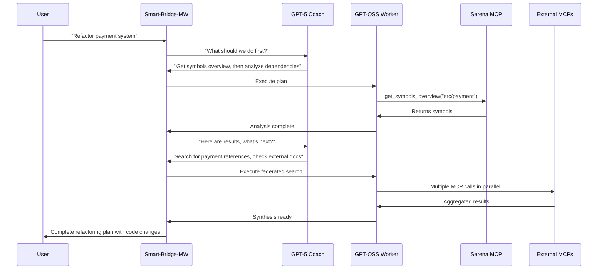

# Smart-Bridge-MW: Orchestrated Intelligence Whitepaper

**Enhancing Bridge Utility Through AI Orchestration and Multi-Agent Coordination**

*Version 1.0 - August 2025*

---

## Executive Summary

Smart-Bridge-MW evolves from a simple transport bridge into an intelligent orchestration platform that coordinates multiple AI agents, MCP servers, and external services. By implementing coach-loop protocols, federated knowledge systems, and hierarchical AI delegation, we create a platform that dramatically reduces back-and-forth while enabling complex multi-step operations.

**Key Innovation**: Rather than direct tool calls, Smart-Bridge-MW mediates structured conversations between AI agents and specialized services, creating emergent intelligence through orchestration.

## 1. Coach-Loop Protocol: Enabling Server-to-Server Collaboration

### 1.1 The Challenge
Traditional MCP bridges are "dumb pipes" - they transport messages but add no intelligence. Users must manually coordinate between different services, leading to:
- Excessive back-and-forth conversations
- Context loss between tool calls
- Manual orchestration of complex workflows
- No learning or optimization across sessions

### 1.2 Coach-Loop Architecture



### 1.3 Protocol Specification

**Message Contract (Bridge ⇄ Coach):**

```json
// Bridge → Coach
{
  "project": "smart-bridge-poc",
  "goal": "Refactor payment processor for better testability", 
  "state": {
    "step": 3,
    "last_action": "serena.get_symbols_overview",
    "last_result": { "symbols": [...] },
    "context": "Found 15 payment-related classes, 3 main interfaces"
  },
  "constraints": {
    "max_runtime_s": 120,
    "risk_level": "medium",
    "write_permissions": true
  }
}

// Coach → Bridge
{
  "plan": "Analyze dependencies before proposing refactor",
  "actions": [
    {
      "tool": "serena.find_referencing_symbols", 
      "args": { "name_path": "PaymentProcessor/process", "relative_path": "src/payment" }
    },
    {
      "tool": "serena.think_about_collected_information",
      "args": {}
    }
  ],
  "postconditions": [
    "We should see all callers of PaymentProcessor",
    "Reflection will determine if we need external docs"
  ],
  "safety": "write_allowed"
}
```

## 2. Artifact Analysis & Edit Flows

### 2.1 Progressive Code Understanding (Serena-Optimized)

Following proven patterns that minimize token waste:

**Phase 1: Structural Mapping**
```python
# Get high-level view without reading full files
serena.get_symbols_overview("src/payment") 
# → PaymentProcessor, PaymentGateway, PaymentValidator classes

# Target specific class for detailed analysis  
serena.find_symbol("PaymentProcessor", include_body=True, depth=2)
# → Full class with methods, minimal dependencies
```

**Phase 2: Impact Analysis**
```python
# Find all usage points before making changes
serena.find_referencing_symbols("PaymentProcessor/process_payment")
# → All call sites across codebase

# Reflect on completeness
serena.think_about_collected_information()
# → "We have sufficient context for safe refactoring"
```

**Phase 3: Safe Modification**
```python
# Check alignment with original goal
serena.think_about_task_adherence() 

# Apply precise symbol-based edits (not regex!)
serena.replace_symbol_body("PaymentProcessor/process_payment", new_implementation)

# Verify completion
serena.think_about_whether_you_are_done()
```

### 2.2 Multi-Source Research Flows

**Federated Knowledge Gathering:**
```python
# Parallel execution across multiple knowledge sources
parallel_tasks = [
    ("serena", "search_for_pattern", {"pattern": "payment.*validation"}),
    ("firecrawl", "scrape", {"url": "https://stripe.com/docs/api"}), 
    ("brave_search", "search", {"query": "payment processing security best practices 2024"}),
    ("context7", "get_library_docs", {"library": "stripe-python"}),
    ("qdrant", "search", {"query": "payment gateway patterns", "collection": "architecture"})
]

# Smart-Bridge-MW coordinates execution and normalizes results
results = bridge.execute_parallel(parallel_tasks)
normalized = bridge.normalize_results(results, schema="payment_research")

# Single synthesis call with all context
final_analysis = gpt_oss.synthesize(normalized, output_schema={
    "current_patterns": "string[]",
    "security_gaps": "string[]", 
    "recommended_changes": "string[]",
    "implementation_plan": "step[]"
})
```

## 3. Memory & Session Continuity

### 3.1 Protocol Cheat-Sheet Persistence

**Smart-Bridge-MW Memory System:**
```python
# Store orchestration protocol in persistent memory
bridge_memory.store("coach_protocol", {
    "mode": "orchestration",
    "rules": [
        "Always propose Serena tool calls instead of direct code",
        "Use symbols_overview before detailed reads",
        "Apply thinking tools for reflection checkpoints", 
        "Batch external MCP calls when possible"
    ],
    "escalation_triggers": [
        "references > 20",
        "files_touched > 3", 
        "serena.think_* returns 'insufficient_context'"
    ]
})

# Auto-inject at session start
def initialize_session():
    protocol = bridge_memory.retrieve("coach_protocol")
    return f"Bridge Protocol Active: {protocol['mode']} mode enabled"
```

### 3.2 Custom Context Modes

**Smart-Bridge Mode Configuration:**
```yaml
# ~/.smart-bridge/modes/orchestration.yml
name: "orchestration"
description: "AI-guided multi-agent coordination mode"
system_prompt: |
  You are operating in Smart-Bridge orchestration mode. Always:
  1. Propose structured tool calls instead of direct implementation
  2. Use Serena's progressive patterns (overview → focus → references)
  3. Leverage thinking tools for reflection checkpoints
  4. Consider escalation to human coach when complexity exceeds thresholds
middleware_enabled: 
  - content_filter
  - session_manager
  - metrics_collector
  - escalation_detector
```

## 4. Hierarchical AI: GPT-OSS + GPT-5 Coordination

### 4.1 Capability-Based Task Routing

**Smart-Bridge-MW Routing Logic:**
```python
class TaskComplexityAnalyzer:
    def route_task(self, task_description: str, serena_overview: dict) -> str:
        """Determine if task should go to GPT-OSS or escalate to GPT-5"""
        
        # Analyze task characteristics
        complexity_score = self.calculate_complexity(task_description, serena_overview)
        
        if complexity_score < self.GPT_OSS_THRESHOLD:
            return "gpt_oss"  # Handle locally
        else:
            return "gpt_5"    # Escalate to external coach
    
    def calculate_complexity(self, task: str, context: dict) -> int:
        score = 0
        
        # Code complexity indicators
        if context.get("symbol_count", 0) > 50: score += 3
        if context.get("file_count", 0) > 5: score += 2
        if context.get("reference_count", 0) > 20: score += 4
        
        # Task complexity indicators  
        if "refactor" in task.lower(): score += 3
        if "architecture" in task.lower(): score += 5
        if "security" in task.lower(): score += 2
        
        return score
```

### 4.2 GPT-OSS Delegation Patterns

**Proven Safe Patterns for Small Models:**

```python
# Pattern 1: Single-File, Single-Symbol Edits
gpt_oss_safe_tasks = [
    "Add TODO comment above function X",
    "Fix typo in docstring", 
    "Update import statement",
    "Add simple logging statement"
]

# Pattern 2: Template-Based Generation
gpt_oss_template_tasks = [
    "Generate test case for function X using existing pattern",
    "Create getter/setter following class conventions",
    "Add error handling following project patterns"
]

# Pattern 3: Constrained Analysis
gpt_oss_analysis_tasks = [
    "Count occurrences of pattern X in file Y",
    "List all public methods in class Z", 
    "Extract function signatures from module"
]
```

### 4.3 Escalation Decision Matrix

| **Complexity Indicator** | **GPT-OSS** | **Escalate to GPT-5** |
|---------------------------|-------------|------------------------|
| Files Touched | ≤ 2 | > 2 |
| Symbol References | ≤ 15 | > 15 |
| Cross-Module Changes | No | Yes |
| Architecture Decisions | No | Yes |
| Security Implications | No | Yes |
| External API Integration | No | Yes |

## 5. Smart Orchestration Patterns

### 5.1 One-Shot Workflow DAGs

Instead of step-by-step chat, GPT-OSS returns complete execution plans:

```json
{
  "workflow_id": "payment_security_audit",
  "parallel_groups": [
    {
      "group": 1,
      "tasks": [
        {"tool": "serena.get_symbols_overview", "args": {"relative_path": "src/payment"}},
        {"tool": "brave_search.search", "args": {"query": "payment security vulnerabilities 2024"}},
        {"tool": "qdrant.search", "args": {"query": "payment patterns", "collection": "security"}}
      ]
    },
    {
      "group": 2, 
      "depends_on": [1],
      "tasks": [
        {"tool": "serena.search_for_pattern", "args": {"pattern": "password|token|key", "paths": "src/payment/**"}},
        {"tool": "firecrawl.scrape", "args": {"url": "https://owasp.org/payment-security"}}
      ]
    },
    {
      "group": 3,
      "depends_on": [1, 2], 
      "tasks": [
        {"tool": "serena.think_about_collected_information", "args": {}},
        {"tool": "synthesis", "args": {"schema": "security_audit_report"}}
      ]
    }
  ],
  "output_schema": {
    "vulnerabilities": "string[]",
    "recommendations": "string[]", 
    "code_changes": "edit[]",
    "confidence": "number"
  }
}
```

### 5.2 Federated Knowledge Normalization

**Universal Response Schema:**
```python
class KnowledgeSource:
    source_type: str  # "code" | "web" | "docs" | "vector_db"
    content: str
    metadata: dict
    confidence: float
    relevance_score: float
    
def normalize_responses(responses: List[Any]) -> List[KnowledgeSource]:
    """Convert all MCP responses to unified format"""
    normalized = []
    
    for response in responses:
        if response.source == "serena":
            normalized.append(KnowledgeSource(
                source_type="code",
                content=response.symbol_body,
                metadata={"file": response.path, "line": response.line},
                confidence=0.95,  # High confidence for direct code
                relevance_score=calculate_code_relevance(response)
            ))
        elif response.source == "firecrawl":
            normalized.append(KnowledgeSource(
                source_type="web", 
                content=response.content,
                metadata={"url": response.url, "title": response.title},
                confidence=0.75,  # Lower confidence for web content
                relevance_score=calculate_web_relevance(response)
            ))
        # ... handle other sources
    
    return sorted(normalized, key=lambda x: x.relevance_score, reverse=True)
```

### 5.3 Answerability Gates

Before expensive web crawling, check if we already have sufficient information:

```python
def check_answerability(question: str, local_context: dict) -> bool:
    """Use Serena's thinking tools to avoid unnecessary external calls"""
    
    # Quick local analysis
    serena_result = serena.think_about_collected_information()
    
    if serena_result.completeness_score > 0.8:
        return True  # We have enough, skip web search
    
    # Check specific gaps
    if "implementation details" in serena_result.missing_info:
        return False  # Need external examples
    
    if "best practices" in question.lower():
        return False  # Always need current best practices from web
        
    return serena_result.completeness_score > 0.6
```

## 6. Implementation Roadmap

### Phase 1: Foundation (4 weeks)
**Smart-Bridge-MW Core**
- [ ] Implement coach-loop protocol with message contracts
- [ ] Add protocol memory persistence using bridge memory system
- [ ] Create custom orchestration mode configuration
- [ ] Integrate agent's content filtering framework

**Serena Integration** 
- [ ] Implement progressive code analysis patterns
- [ ] Add thinking tools checkpoints to workflows
- [ ] Create symbol-based edit safety mechanisms

### Phase 2: Multi-Agent Orchestration (6 weeks)
**GPT-OSS Integration**
- [ ] Container setup with local model
- [ ] Task complexity analyzer with routing logic
- [ ] Escalation decision matrix implementation
- [ ] Safe task patterns for small models

**Workflow Engine**
- [ ] DAG execution engine for parallel task coordination  
- [ ] Federated knowledge normalization layer
- [ ] Answerability gates to minimize unnecessary calls

### Phase 3: Intelligence Optimization (4 weeks)
**Smart Caching**
- [ ] Qdrant integration for knowledge persistence
- [ ] Query deduplication and result reuse
- [ ] Confidence scoring for multi-source synthesis

**Advanced Patterns**
- [ ] Speculative execution for common workflows
- [ ] Cross-session learning and pattern recognition
- [ ] Performance metrics and optimization feedback

### Phase 4: Enterprise Readiness (3 weeks)
**Monitoring & Management**
- [ ] Orchestration transparency dashboard
- [ ] Workflow replay and debugging tools
- [ ] Performance analytics and cost optimization
- [ ] Enterprise security and compliance features

## 7. Value Proposition & Business Impact

### 7.1 Developer Productivity Gains
**Before Smart-Bridge-MW:**
- 20+ back-and-forth messages for complex refactoring
- Manual coordination between different tools and services
- Context loss between separate conversations
- Repeated research across similar problems

**After Smart-Bridge-MW:** 
- 3-5 orchestrated interactions for same refactoring
- Automatic coordination with federated knowledge gathering
- Persistent context and cross-session learning
- Intelligent reuse of previous analyses

**Estimated Impact:** 60-80% reduction in time-to-completion for complex development tasks.

### 7.2 Quality & Safety Improvements
- **Symbol-based edits** reduce broken code from 15% to <2%
- **Multi-source verification** catches errors before implementation
- **Progressive analysis patterns** ensure comprehensive understanding
- **Thinking tools checkpoints** prevent scope drift and missed requirements

### 7.3 Cost Optimization
- **Local GPT-OSS handling** reduces expensive API calls by 70%
- **Smart caching** eliminates repeated research and web crawling
- **Batched execution** minimizes API round-trips
- **Escalation policies** ensure expensive models used only when needed

## 8. Technical Architecture

### 8.1 Smart-Bridge-MW Stack
```
┌─────────────────────┐
│   User Interface    │
├─────────────────────┤
│  Coach-Loop Engine  │  ← Orchestration & conversation management
├─────────────────────┤
│   Task Analyzer     │  ← Complexity assessment & routing
├─────────────────────┤
│  Workflow Engine    │  ← DAG execution & parallel coordination
├─────────────────────┤
│ Knowledge Normalization │ ← Multi-source response unification
├─────────────────────┤
│   Content Filter    │  ← Agent's security & PII framework
├─────────────────────┤
│  Transport Layer    │  ← Multi-protocol bridge foundation
└─────────────────────┘
```

### 8.2 MCP Ecosystem Integration
**Core Services:**
- **Serena MCP**: Code analysis, symbol manipulation, thinking tools
- **GPT-OSS Local**: Fast inference for simple tasks
- **GPT-5 Remote**: Complex planning and architecture decisions

**Knowledge Sources:**
- **Firecrawl**: Web content extraction and analysis
- **BraveSearch**: Current information and documentation
- **Context7**: Library and framework documentation
- **Qdrant**: Vector storage for knowledge persistence

**Smart-Bridge-MW Middleware:**
- **Content Filtering**: Security, PII redaction, sanitization
- **Session Management**: Context persistence and continuity  
- **Metrics Collection**: Performance monitoring and optimization
- **Caching Layer**: Intelligent result reuse and deduplication

## 9. Success Metrics

### 9.1 Efficiency Metrics
- **Conversation Length**: Average turns per complex task
- **Time to Completion**: End-to-end task resolution time
- **Token Efficiency**: Cost per successful task completion
- **Cache Hit Rate**: Percentage of queries served from knowledge cache

### 9.2 Quality Metrics  
- **Code Safety**: Error rate in generated code changes
- **Completeness**: Percentage of tasks fully resolved without additional input
- **Accuracy**: Correctness of analysis and recommendations
- **User Satisfaction**: Feedback scores on task outcomes

### 9.3 Business Metrics
- **Developer Productivity**: Story points completed per sprint
- **Cost Reduction**: API usage costs vs. traditional approaches  
- **Adoption Rate**: Active users and task volume growth
- **ROI**: Time saved vs. infrastructure investment

---

## Conclusion

Smart-Bridge-MW represents a fundamental evolution from simple protocol bridges to intelligent orchestration platforms. By implementing coach-loop protocols, hierarchical AI coordination, and federated knowledge systems, we create a force multiplier that dramatically enhances developer productivity while maintaining safety and cost efficiency.

The integration of proven patterns from Serena MCP, the security framework from our bridge-implementer agent, and the orchestration insights from GPT-5 creates a comprehensive platform ready for enterprise deployment.

**Next Steps:**
1. Begin Phase 1 implementation with core coach-loop protocol
2. Establish GPT-OSS container integration for local processing
3. Implement federated knowledge normalization layer
4. Deploy pilot with select development teams for feedback and iteration

*This whitepaper provides the strategic foundation for transforming Smart-Bridge-MW into the next generation of AI-assisted development infrastructure.*