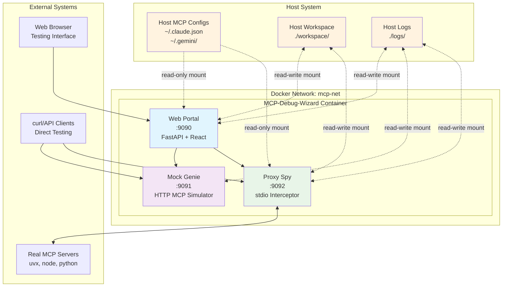
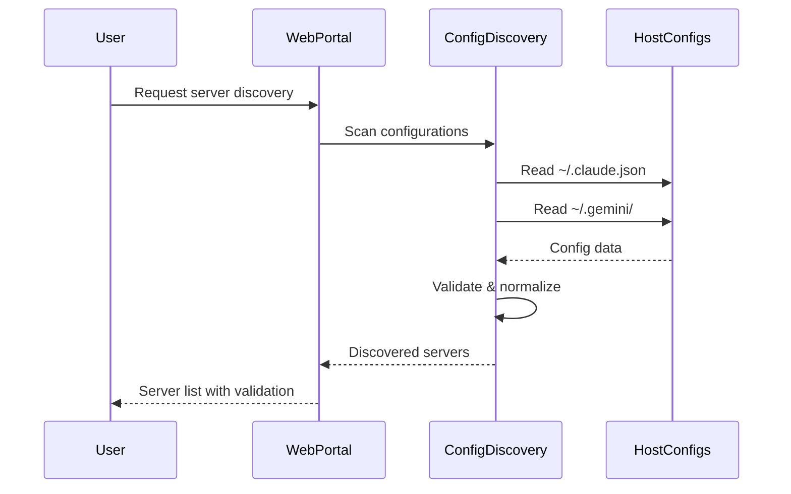
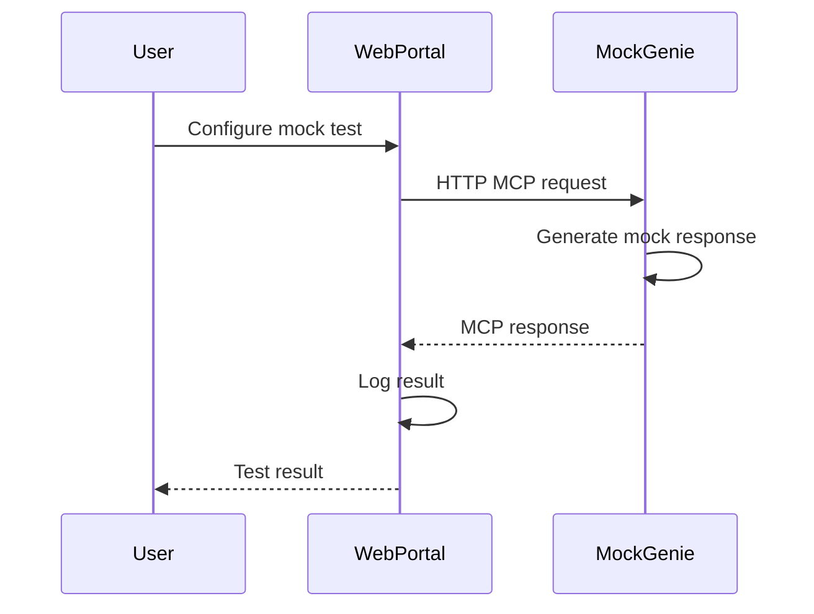
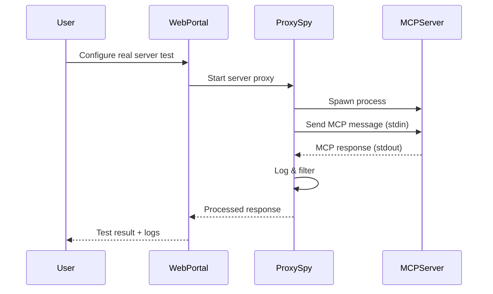

# System Architecture Overview

The **MCP Debug Wizard** is designed as a modular, containerized testing environment that provides comprehensive MCP server testing capabilities while maintaining security and isolation.

## 🎯 Design Principles

### 1. **Safety First** 🛡️
- Read-only access to host MCP configurations
- Non-root container execution
- Isolated network environment
- No persistent modifications to host system

### 2. **Comprehensive Testing** 🔍
- HTTP-based protocol simulation (Mock Genie)
- Real stdio communication interception (Proxy Spy)
- Visual testing interface (Web Portal)
- Automated test suite execution

### 3. **Developer Experience** 🚀
- Auto-discovery of existing MCP servers
- Real-time communication monitoring
- Interactive testing interface
- Extensible architecture for custom features

### 4. **Production Ready** 📦
- Container-based deployment
- Health monitoring
- Logging and debugging capabilities
- Scalable architecture

## 🏗️ High-Level Architecture



## 🔧 Core Components

### 1. **Web Portal** (Port 9090)
**Technology**: FastAPI + React SPA
**Role**: Central control hub and user interface

**Responsibilities**:
- Server discovery and configuration management
- Test suite creation and execution
- Real-time monitoring dashboard
- API gateway for other services
- WebSocket communication for live updates

**Key Features**:
- Auto-discovery of MCP servers from host configs
- Interactive tool testing interface
- Test suite management
- Communication log visualization
- Server health monitoring

### 2. **Mock Genie** (Port 9091)
**Technology**: FastAPI HTTP server
**Role**: MCP protocol simulator

**Responsibilities**:
- Simulate MCP JSON-RPC 2.0 protocol over HTTP
- Provide configurable mock responses
- Log all incoming requests for debugging
- Support for tools, resources, and logging capabilities

**Key Features**:
- HTTP-based MCP implementation
- Configurable mock tools and resources
- Request/response logging
- Protocol compliance testing
- Error scenario simulation

### 3. **Proxy Spy** (Port 9092)
**Technology**: FastAPI + asyncio subprocess management
**Role**: stdio communication interceptor

**Responsibilities**:
- Spawn and manage real MCP server processes
- Intercept stdin/stdout communication
- Apply filtering and modification rules
- Provide real-time communication logging
- WebSocket streaming of message flow

**Key Features**:
- Full stdio MCP protocol support
- Real-time message interception
- Communication filtering (delays, errors, modifications)
- Process lifecycle management
- Live debugging capabilities

## 📊 Data Flow

### 1. **Server Discovery Flow**


### 2. **Mock Testing Flow**


### 3. **Real Server Testing Flow**


## 🔒 Security Model

### Container Isolation
- **Non-root user**: All processes run as `mcpuser` (uid 1000)
- **Network isolation**: Custom Docker network `mcp-net`
- **Resource limits**: Container resource constraints
- **Read-only configs**: Host MCP configs mounted read-only

### File System Access
- **Host configs**: Read-only access to `~/.claude.json`, `~/.gemini/`
- **Workspace**: Read-write access to `./workspace` for testing
- **Logs**: Read-write access to `./logs` for debugging
- **No home access**: Container cannot modify host user files

### Network Security
- **Local binding**: All services bind to container localhost
- **Port exposure**: Only specific ports exposed to host
- **No internet**: No outbound internet access required (optional)

## 🚀 Scalability Considerations

### Horizontal Scaling
- **Service separation**: Each component can be scaled independently
- **Stateless design**: No persistent state in containers
- **Load balancing**: Multiple instances behind reverse proxy

### Resource Management
- **Memory limits**: Configurable container memory limits
- **CPU limits**: Configurable CPU allocation
- **Process limits**: Maximum concurrent MCP server processes

### Storage
- **Log rotation**: Automatic log cleanup and rotation
- **Temporary files**: Cleanup of workspace temporary files
- **Volume management**: Persistent workspace data

## 🔌 Extension Points

### Custom Filters
```python
def custom_filter(message: dict, direction: str) -> tuple[dict, bool]:
    """Custom message filter implementation"""
    # Modify message logic here
    return modified_message, was_filtered
```

### Custom Mock Responses
```python
mock_tools["custom_tool"] = {
    "name": "custom_tool",
    "description": "Custom tool description",
    "inputSchema": {...}
}
```

### Plugin Architecture
- **Tool plugins**: Add new mock tools
- **Filter plugins**: Custom communication filters
- **UI plugins**: Extend web interface
- **Protocol plugins**: Support new MCP versions

## 📈 Monitoring & Observability

### Health Checks
- **Container health**: Docker health check endpoints
- **Service health**: Individual service status
- **Dependency health**: External service connectivity

### Logging
- **Structured logs**: JSON-formatted log entries
- **Log levels**: Configurable logging verbosity
- **Log aggregation**: Centralized log collection
- **Real-time streaming**: WebSocket log streaming

### Metrics
- **Performance metrics**: Response times, throughput
- **Usage metrics**: Tool usage, server activity
- **Error metrics**: Failure rates, error patterns
- **Resource metrics**: Memory, CPU usage

## 🔄 Development Workflow

### Local Development
1. **Code changes**: Edit source files
2. **Container rebuild**: `docker-compose build`
3. **Service restart**: `docker-compose up`
4. **Testing**: Access services via localhost

### Production Deployment
1. **Image build**: Create production Docker images
2. **Configuration**: Environment-specific configs
3. **Deployment**: Container orchestration platform
4. **Monitoring**: Health checks and alerting

This architecture provides a robust, secure, and extensible foundation for MCP server testing while maintaining simplicity for end users.