# MCP Testing Suite V2: Dynamic Project Launcher Architecture

## 🎯 Vision: From Fixed-Config Tool to Dynamic Testing Platform

The current architecture has a critical limitation: **fixed volume mounts** that lock users into predefined configuration locations. This redesign transforms the MCP Testing Suite into a **dynamic, project-aware testing platform** that adapts to different development workflows.

## 🔄 Architecture Evolution

### Current V1 Architecture (Limitations)

```mermaid
graph TB
    subgraph "Fixed Container Setup"
        DC[docker-compose.yml<br/>Fixed volume mounts]
        AC[All-in-One Container<br/>~/.claude.json → /mcp-configs]
        WI[Web Interface<br/>Hard-coded config paths]
    end
    
    subgraph "User Problems"
        UP1[❌ Can't test project configs]
        UP2[❌ Must restart to change configs]
        UP3[❌ Limited to user-level MCP servers]
        UP4[❌ No team config sharing]
    end
    
    DC --> AC
    AC --> UP1
    AC --> UP2
    AC --> UP3
    AC --> UP4
```


### Proposed V2 Architecture (Solutions)


## 🏗️ Component Architecture

### **Stage 1: Project Launcher** (MCP-Suite-Web-Portal)
**Role**: Smart configuration selector and backend launcher
**Technology**: FastAPI + Simple React UI
**Port**: 8094 (always available)

**Responsibilities**:
- 🎯 **Project Discovery**: Scan directories for MCP configurations
- 🔧 **Config Selection**: User picks project/config combination
- 🚀 **Backend Launcher**: Dynamically start testing backend with custom mounts
- 📊 **Session Management**: Track active testing sessions

**Key Features**:
```javascript
// Example launcher interface
{
  projectPaths: [
    "/home/user/mcp-project-1/",
    "/home/user/experiments/mcp-configs/",
    "/team-shared/mcp-setups/"
  ],
  configSources: [
    {type: "project", path: "./mcp.json"},
    {type: "user", path: "~/.claude.json"},
    {type: "custom", path: "/custom/test-configs/"}
  ],
  testScenarios: [
    "development", "staging", "integration", "custom"
  ]
}
```

### **Stage 2: Dynamic Testing Backend**
**Role**: Project-specific MCP testing environment  
**Technology**: FastAPI + MCP Protocol Implementation
**Ports**: 8095-8096 (started per session)

**Dynamic Launch Command**:
```bash
# Generated dynamically based on user selection
docker run --rm \
  --name "MCP-Suite-Testing-$(date +%s)" \
  -v "/selected/project/path:/workspace:rw" \
  -v "/selected/config/path:/mcp-configs:ro" \
  -v "./session-logs:/app/logs:rw" \
  -p 8095-8096:8095-8096 \
  mcp-suite-testing
```

## 🔄 User Workflow

### **1. Initial Launch**
```bash
# Start lightweight launcher (no project dependencies)
docker run -p 8094:8094 mcp-suite-launcher
```

### **2. Project Selection** (Web UI at :8094)
1. **Browse Projects**: Scan for directories with MCP configs
2. **Choose Config Source**: 
   - Project-level (`.mcp.json`, `./configs/`)
   - User-level (`~/.claude.json`, `~/.gemini/`)
   - Custom path (anywhere on filesystem)
3. **Select Test Scenario**: Development, staging, etc.
4. **Launch Backend**: Creates testing environment with exact setup

### **3. Testing Session** (Backend at :8095-8096)
- **Isolated Environment**: Only sees selected project/config
- **Full MCP Testing**: Discover, activate, test servers
- **Project Context**: Workspace mounted to project directory
- **Session Logs**: Dedicated logging per testing session

### **4. Session Management**
- **Multiple Sessions**: Run different projects simultaneously
- **Clean Termination**: Stop backend when done testing
- **Session History**: Track what was tested when

## 📁 Configuration Discovery Hierarchy

### **Priority Order** (V2 vs V1)

**V1 (Current - Problematic)**:
1. User configs (`~/.claude.json`) - Fixed mount
2. Built-in test servers - Hardcoded
3. ❌ No project-level support
4. ❌ No custom locations

**V2 (Proposed - Flexible)**:
1. **Custom Location** (User-specified) - Highest priority
2. **Project Level** (`.mcp.json`, `./configs/`) - New!
3. **User Level** (`~/.claude.json`, `~/.gemini/`) - When selected
4. **Built-in Test Servers** - Fallback

### **Configuration Sources**

**Project-Level Configurations**:
```bash
./mcp.json                 # Project MCP servers
./configs/mcp-config.json  # Alternative location
./test-configs/            # Testing-specific configs
./.mcp/                    # Hidden MCP directory
```

**Team-Shared Configurations**:
```bash
/team-shared/mcp-setups/
/project/shared-configs/
/network/mcp-test-configs/
```

**Custom Testing Configurations**:
```bash
/tmp/experimental-mcp/
~/Downloads/test-configs/
/usb-drive/mcp-setups/
```

## 🚀 Implementation Benefits

### **For Individual Developers**
✅ **Project Isolation**: Each project's MCP setup is independent  
✅ **Experiment Safely**: Test configs without affecting global setup  
✅ **Version Control**: Project configs can be committed to git  
✅ **Multiple Projects**: Test different projects simultaneously  

### **For Teams**
✅ **Shared Configurations**: Team members use identical MCP setups  
✅ **Reproducible Testing**: Same test environment across team  
✅ **CI/CD Integration**: Automated testing with project configs  
✅ **Onboarding**: New team members get working MCP setup instantly  

### **For Testing Tool**
✅ **No Volume Mount Restrictions**: Any config location supported  
✅ **Session Isolation**: Each test session is independent  
✅ **Dynamic Resource Allocation**: Only run what's needed  
✅ **Extensible**: Easy to add new config sources  

## 📊 Technical Implementation

### **Launcher API Endpoints**
```python
# Project discovery
GET  /api/scan-projects?path=/optional/path
POST /api/launch-backend
GET  /api/active-sessions
POST /api/terminate-session/{session_id}

# Session management  
GET  /api/sessions/{session_id}/status
GET  /api/sessions/{session_id}/logs
```

### **Backend Launch Logic**
```python
def launch_testing_backend(config: LaunchConfig):
    """Launch dynamic testing backend with custom mounts"""
    
    # Validate config sources
    validate_project_path(config.project_path)
    validate_config_source(config.config_source)
    
    # Generate unique session
    session_id = generate_session_id()
    
    # Create dynamic Docker command
    docker_cmd = [
        "docker", "run", "--rm", "-d",
        f"--name=MCP-Suite-Testing-{session_id}",
        f"-v={config.project_path}:/workspace:rw",
        f"-v={config.config_source}:/mcp-configs:ro", 
        f"-v=./session-{session_id}-logs:/app/logs:rw",
        "-p=8095-8096:8095-8096",
        "mcp-testing-backend"
    ]
    
    # Launch and track session
    result = subprocess.run(docker_cmd)
    track_session(session_id, config, result)
    
    return {
        "session_id": session_id,
        "backend_url": f"http://localhost:8095",
        "status": "starting"
    }
```

## 🔄 Migration Strategy

### **Phase 1: Launcher Implementation**
1. Create lightweight project selector UI
2. Implement project/config discovery  
3. Add dynamic backend launcher
4. Basic session management

### **Phase 2: Enhanced Discovery**
1. Add project-level config support (`.mcp.json`)
2. Improve config validation and normalization
3. Add team config sharing features
4. Custom config location support

### **Phase 3: Advanced Features**
1. Multiple simultaneous sessions
2. Session persistence and recovery
3. Advanced filtering and testing
4. CI/CD integration helpers

### **Phase 4: Production Ready**
1. Resource management and limits
2. Security hardening
3. Performance optimization
4. Comprehensive documentation

## 🎯 Success Metrics

**Developer Experience**:
- ⏱️ **Setup Time**: From clone to testing < 2 minutes
- 🔄 **Config Switching**: Change test environment < 30 seconds  
- 🧪 **Test Isolation**: Zero cross-contamination between projects
- 📈 **Team Adoption**: Easy shared configuration setup

**Technical Goals**:
- 🚀 **Startup Performance**: Launcher starts in < 5 seconds
- 💾 **Resource Efficiency**: Only consume resources during active testing
- 🔧 **Maintainability**: Clear separation between launcher and backend
- 📦 **Deployment**: Single container for launcher, dynamic backends

This architecture transformation makes the MCP Testing Suite truly useful for project-based development while maintaining the security and isolation benefits of the containerized approach.